### Architecture Summary
- This repository implements a governed AI engineering operating model that turns repository context into safe, reusable project workflows, prompts, and skills.
- Users interact through VS Code, Copilot Chat, and slash prompts, while the intelligence layer reasons over the repository, skills, and policy constraints before action.
- The orchestration layer plans, routes, and tracks work through approval gates, execution state, and defined validation steps before any privileged action is taken.
- Deterministic automation performs schema checks, security validation, project setup, release verification, and evidence capture across the governed lifecycle.
- Governance, auditability, and human approval remain visible controls that turn AI assistance into measurable business outcomes such as faster onboarding, lower risk, and stronger compliance.

### Mermaid Diagram

To render this diagram in VS Code, install the recommended Mermaid extension and open the Markdown preview with `Ctrl+Shift+V`. GitHub and other Mermaid-enabled Markdown viewers render the fenced block directly.

```mermaid
flowchart LR
    classDef user fill:#dfeefb,stroke:#2c6aa0,stroke-width:1.5px,color:#0f2439
    classDef experience fill:#dfe9ff,stroke:#3a64d8,stroke-width:1.5px,color:#16213d
    classDef intelligence fill:#efe7ff,stroke:#6d4bb7,stroke-width:1.5px,color:#20163d
    classDef orchestration fill:#dfeaf6,stroke:#1a4d7a,stroke-width:1.5px,color:#0d2233
    classDef automation fill:#dff7f7,stroke:#1b8fa1,stroke-width:1.5px,color:#0b2e36
    classDef data fill:#dff5f1,stroke:#0f8b78,stroke-width:1.5px,color:#0d2e2a
    classDef enterprise fill:#edf1f4,stroke:#4d5d6c,stroke-width:1.5px,color:#1f2a33
    classDef governance fill:#fff0c9,stroke:#d98d18,stroke-width:1.5px,color:#422b00
    classDef outcome fill:#dff5e5,stroke:#2b8f56,stroke-width:1.5px,color:#163a2c

    title[Project Skills Orchestrator]

    subgraph U[Users & Personas]
        U1[Engineering Teams]
        U2[Platform Owners]
        U3[Security Reviewers]
    end

    subgraph E[Experience Layer]
        E1[VS Code]
        E2[Copilot Chat]
        E3[Slash Prompts]
    end

    subgraph I[AI & Intelligence]
        I1[Skill Catalog]
        I2[Reasoning Engine]
        I3[Repository Context]
    end

    subgraph O[Agentic Orchestration]
        O1[Project Skills Orchestrator]
        O2[Workflow Planner]
        O3[Execution State]
    end

    subgraph A[Automation & Validation]
        A1[Schema Validation]
        A2[Security Check]
        A3[Release Verify]
    end

    subgraph D[Knowledge & Data]
        D1[Reports]
        D2[Schemas]
        D3[Blueprints]
    end

    subgraph S[Enterprise Systems]
        S1[GitHub Repos]
        S2[Azure Discovery]
        S3[Project Workspaces]
    end

    subgraph G[Governance & Control]
        G1[Identity & Access]
        G2[Policy Enforcement]
        G3[Human Approval]
        G4[Audit & Observability]
        G5[Responsible AI Guardrails]
    end

    subgraph Y[Business Outcomes]
        Y1[Faster Onboarding]
        Y2[Lower Risk]
        Y3[Stronger Compliance]
        Y4[Accelerated Delivery]
    end

    title -->|Guides| U1
    U1 -->|Requests| E1
    U2 -->|Approves| G3
    U3 -->|Reviews| G5

    E1 -->|Uses| E2
    E2 -->|Invokes| E3
    E3 -->|Routes work| O1

    O1 -->|Selects skills| I1
    I1 -->|Reasons over| I2
    I2 -->|Reads| I3
    I2 -->|Retrieves| D1
    I2 -->|Discovers| S2

    O1 -->|Plans| O2
    O2 -->|Tracks| O3
    O3 -->|Triggers| A1
    A1 -->|Validates| A2
    A2 -->|Verifies| A3
    A3 -->|Records evidence| D1

    O1 -->|Applies| G2
    G2 -->|Enforces| G1
    G2 -->|Requires| G3
    G3 -->|Monitors| G4
    G5 -->|Protects| O1
    G4 -->|Audits| D2

    A3 -->|Connects to| S1
    A1 -->|Uses| D2
    O2 -->|Generates| D3
    D3 -->|Feeds| S3

    D1 -->|Improves| Y3
    A2 -->|Reduces| Y2
    O2 -->|Accelerates| Y4
    E3 -->|Simplifies| Y1

    class U1,U2,U3 user
    class E1,E2,E3 experience
    class I1,I2,I3 intelligence
    class O1,O2,O3 orchestration
    class A1,A2,A3 automation
    class D1,D2,D3 data
    class S1,S2,S3 enterprise
    class G1,G2,G3,G4,G5 governance
    class Y1,Y2,Y3,Y4 outcome

    legend[Users → Experience → AI → Orchestration → Automation → Governance → Outcomes]
    legend:::outcome
```

### Executive Story
- This architecture turns repository context into a governed operating model, where AI recommendations are guided by policy, validation, and human approval instead of uncontrolled autonomous action.
- The flow is intentionally clear: users request work in the experience layer, the intelligence layer reasons over repository context, and the orchestration layer coordinates policy-controlled execution.
- The result is measurable business value—faster onboarding, lower operational risk, stronger compliance, and faster delivery—without sacrificing auditability or decision control.
