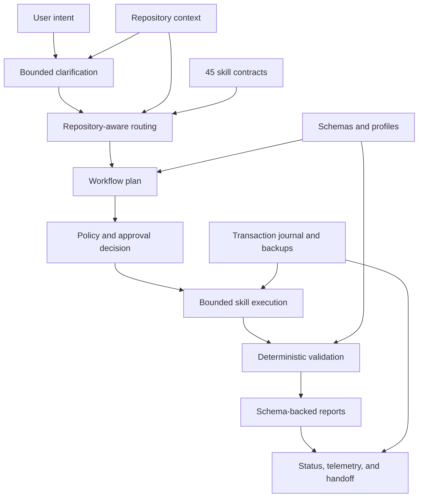
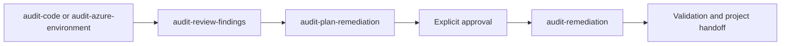

# Project Orchestrator: Complete Project Overview

> **Evidence snapshot:** This overview describes Project Orchestrator runtime version `1.1.1` and framework version `9.0.0` at commit `0981867ca6795a9be48428b2f297ba5d6bf09c1d`. It is grounded in the current runtime, configuration, tests, skill inventory, security policy, and release manifest as reviewed on 2026-09-09. Current machine-readable evidence under `reports/` and current source/configuration take precedence if this document later becomes stale.

## Executive Summary

Project Orchestrator turns a repository into a governed GitHub Copilot workspace. It supplies the instructions, scoped engineering standards, reusable prompts, specialist agents, workflow contracts, validation schemas, and evidence needed to use AI-assisted development consistently across a project lifecycle.

The product has two main parts:

1. A registry-free Node.js command-line runtime that creates a governed project, adopts an existing repository, updates an installed project, and verifies the resulting framework.
2. A catalog of 45 governed skills that GitHub Copilot can use for planning, implementation support, audit, remediation, security review, documentation, Azure discovery, continuity, and other bounded workflows.

Its central value is not simply generating files. Its value is making AI-assisted work **repeatable, reviewable, recoverable, and evidence-based**:

- Requests begin with a bounded clarification round so material choices are made explicitly.
- Repository context determines which standards, tasks, extensions, and workflows are appropriate.
- Existing project-owned customization is detected and preserved instead of being blindly replaced.
- Mutating installation is planned, approval-gated, journaled, verified, and automatically rolled back on failure.
- Consequential actions such as deployment, external publication, commit, push, destructive changes, and sensitive disclosure remain separately approval-gated.
- JSON reports and schemas provide durable evidence of decisions, plans, findings, status, and validation.
- The core runtime has no third-party package dependencies and does not require a package registry.

Project Orchestrator is currently an **unsigned internal candidate** for authorized internal use. It is not production-release ready. Trusted signing, independent review, and operational readiness remain explicit release blockers.

## The 30-Second Explanation

Most teams can make Copilot useful in one repository. The harder problem is making it consistent, safe, maintainable, and auditable across many repositories. Project Orchestrator packages that operating model into a registry-free installer and 45 governed skills. It adapts to the target stack, preserves existing work, requires approval at consequential boundaries, records machine-readable evidence, and can roll back failed installation changes.

## Why This Project Exists

AI coding tools are powerful, but a useful enterprise development workflow needs more than a model and a prompt. Each repository also needs:

- clear instructions and ownership boundaries;
- stack-specific coding, testing, and security standards;
- repeatable prompts and specialist roles;
- approval rules for consequential actions;
- reliable setup, validation, and recovery;
- traceable decisions, findings, plans, and handoffs;
- a way to keep all of those assets current without overwriting project-specific work.

Without a shared system, teams repeatedly rebuild these controls by hand. Results drift between repositories, important steps become tribal knowledge, and AI output can be difficult to review or reproduce.

Project Orchestrator addresses that gap. It treats the repository as the durable unit of context and governance. The instructions, skills, schemas, prompts, agents, reports, editor configuration, and lifecycle evidence live with the project under version control.

## Who It Is For

| Audience | Value provided |
| --- | --- |
| Engineering teams | Faster project onboarding, reusable workflows, stack-aware editor support, and fewer repeated setup decisions. |
| Platform engineering | A consistent framework that can be created, adopted, updated, verified, and governed across repositories. |
| Security reviewers | Explicit trust boundaries, security instructions, structured findings, remediation evidence, and fail-closed release gates. |
| Technical leads and architects | Versioned project blueprints, architecture review, workflow planning, decision records, and bounded approval points. |
| Engineering managers | Visible project state, current blockers, handoff records, validation evidence, and a clearer path from intent to delivery. |
| AI and agent builders | A least-privilege Agent Builder, skill contracts, capability boundaries, deterministic plans, and controlled handoffs. |
| Azure teams | Commercial and Azure US Government discovery flows, persisted nonsecret environment choices, and explicit deployment boundaries. |

## The Value Proposition

### Faster, more consistent onboarding

A new project starts with the same governed foundation instead of a collection of manually copied files. An existing repository can adopt missing framework assets through a dry-run-first workflow. Stack declarations and repository detection drive relevant instructions, tasks, debugging support, extension recommendations, and CI behavior.

### Governance without hiding the work

Governance is visible in the workflow rather than buried in a policy document. Clarification results, plans, policy decisions, state transitions, findings, remediation records, and handoffs are stored as project artifacts. The user can inspect what the system believes, what it plans to do, what requires approval, and what evidence supports completion.

### Safer repository mutation

Project adoption uses canonical path checks, symbolic-link rejection, destination-state hashes, an exclusive lock, a persistent pre-write journal, backups, automatic rollback, and explicit recovery. Inspection does not execute commands discovered in the target repository.

### Reuse instead of reinvention

The 45-skill catalog covers common engineering and governance workflows. The inventory and dependency system helps teams reuse an existing skill before creating another overlapping capability.

### Evidence instead of optimistic claims

Machine-readable reports are validated against schemas. Release readiness fails closed when signing, independent review, CI, operational, or revocation evidence is missing or stale. A successful local operation is not silently promoted into a claim of production readiness.

### Portability and lower supply-chain exposure

The core runtime uses Node.js built-ins and has no third-party runtime packages. Skills, schemas, templates, and configuration ship with the repository. Optional Project Video dependencies are isolated, pinned, separately approved exceptions rather than application dependencies.

## What Project Orchestrator Is

Project Orchestrator is all of the following:

- a command-line installer and updater for governed project workspaces;
- a repository-local operating model for GitHub Copilot;
- a catalog of bounded, composable engineering skills;
- a policy and approval framework for consequential agent actions;
- a schema-backed evidence system for plans, reports, and execution state;
- a transactional adoption mechanism with rollback and recovery;
- a project lifecycle that connects clarification, planning, execution, validation, and handoff;
- an extensible baseline for new and existing repositories;
- an internal engineering framework designed to work with VS Code and GitHub Copilot Chat.

## What It Is Not

Project Orchestrator is not:

- an application generator that invents a finished business application;
- a replacement for engineers, security reviewers, architects, or approvers;
- a guarantee that code or configuration is free from defects or vulnerabilities;
- a hosted agent runtime or model-serving platform;
- an automatic deployment or publication service;
- a secret manager or identity provider;
- an authorization to create Azure resources, publish agents, merge code, or release software;
- a replacement for source control, independent backups, non-production testing, or organizational change management;
- dependent on MCP for its core runtime;
- approved for public package publication or third-party distribution.

`create-project` creates a governed development foundation with empty `src/` and `tests/` boundaries. The user and their agents build the application afterward, inside that new target project.

## Product Facts

| Item | Current value |
| --- | --- |
| Product name | Project Orchestrator |
| Compatibility names | `pso`, `pso.mjs`, `project-skills-orchestrator`, and `.skills-orchestrator` remain stable interfaces |
| Runtime version | `1.1.1` |
| Framework version | `9.0.0` |
| Governed skills | 45 |
| Core runtime dependencies | 0 third-party packages |
| Supported Node.js majors | 22, 24, and 26 |
| Default new-project profile | `durable` |
| Supported profiles | `core`, `durable`, `distributed`, `advanced` |
| Distribution | Authorized internal use only |
| Release state | Blocked unsigned internal candidate |

## Architecture



### Experience layer

Users work through VS Code, GitHub Copilot Chat, repository instructions, slash prompts, and specialist agents. VS Code discovers the customization files from their normal repository locations.

### Context and intelligence layer

The agent reads repository instructions, scoped standards, current source and configuration, existing reports, and the skill catalog. Repository evidence and the current request outrank saved memory or stale narrative documentation.

### Orchestration layer

`project-skills-orchestrator` routes work to the correct owning skill. `workflow-planner`, `policy-engine`, and `workflow-state-manager` define the intended sequence, approval boundaries, and deterministic execution state.

### Skill execution layer

Each `SKILL.md` is a bounded contract. It defines purpose, preconditions, inputs, approved tools, read/write boundaries, procedure, validation, outputs, failure behavior, approval gates, dependencies, and examples.

### Deterministic runtime layer

The Node.js runtime creates projects, plans adoption, applies journaled changes, validates framework contracts, inventories skills, manages updates, and recovers interrupted adoption transactions.

### Evidence and governance layer

JSON under `reports/` records authoritative machine-readable evidence. Schemas under `schemas/` constrain plans and reports. Markdown views make the evidence readable without becoming the primary data source.

## The Governed Request Lifecycle

1. **Clarify the request.** The configured default asks exactly three useful questions for an ordinary prompt. Complex, confusing, high-impact, or potentially damaging requests may ask up to five. Material ambiguity blocks work. An explicit `--proceed` token skips the question round for that prompt.
2. **Inspect current evidence.** The agent reads the repository, current reports, nearby implementation, and relevant tests instead of asking the user for facts already available locally.
3. **Route to an owner.** The orchestrator selects one owning skill for each step and prevents overlapping ownership.
4. **Plan the work.** The plan records inputs, outputs, dependencies, approvals, checkpoints, validation, rollback, and recovery routes.
5. **Evaluate policy.** External, privileged, destructive, irreversible, production-data, commit, and push actions require approval by default.
6. **Execute within boundaries.** The selected skill may read and write only its declared surfaces. Unknown or unsafe states fail closed.
7. **Validate behavior.** Focused tests or behavior checks run before broader validation. Required repository gates must pass before completion is claimed.
8. **Record evidence.** Structured JSON and derived Markdown capture results, limitations, and unresolved work.
9. **Hand off continuity.** Project status, decisions, blockers, completed work, and the next approved action are preserved for the next session or owner.

## Core Safety Model

### Clarification before mutation

The framework requires a bounded question round before every new prompt unless the prompt explicitly includes `--proceed`. Question limits do not authorize guessing. If an unresolved choice materially affects security, cost, compatibility, scope, or behavior, the workflow remains blocked.

### Explicit approval classes

The default project configuration requires approval for:

- external actions;
- privileged actions;
- destructive actions;
- irreversible actions;
- production-data mutation;
- commits;
- pushes.

Individual skills add narrower gates. For example, Agent Builder requires direct approval around purchases, commitments, messages, account or permission changes, sensitive disclosure, and destructive actions.

### Transactional project adoption

Before adoption mutates a repository, it:

1. builds and displays a plan;
2. validates managed paths inside the canonical repository root;
3. checks for symbolic-link and traversal escapes;
4. records destination-state hashes;
5. requires explicit risk acceptance;
6. acquires an exclusive adoption lock;
7. writes a persistent journal and backups before each change;
8. rechecks destination state during apply;
9. verifies the installed framework;
10. automatically restores prior state if application or verification fails.

An interrupted transaction can be recovered with the `recover` command after confirming the recorded process is no longer active.

### Preservation of project-owned work

Adoption and update are designed to manage framework-owned assets while preserving application code, reports, and project-authored customizations. Existing instructions are retained, with managed routing blocks added only when absent. Existing equivalent or overlapping assets are reported so the user can decide whether framework templates are necessary.

### Fail-closed release posture

Missing or stale trust evidence blocks release. A local test pass does not satisfy signing, independent review, operational ownership, artifact health, or revocation requirements.

## Installation Requirements

### Required

- A maintained Node.js 22, 24, or 26 release on `PATH`.
- Visual Studio Code with GitHub Copilot and Copilot Chat to use the installed prompts, agents, and skills interactively.
- A trusted source checkout of this repository.

### Conditional

- Git is required for `clone-setup` and normal source-control workflows.
- Azure CLI is required only for Azure workflows.
- Optional Project Video MP4 workflows may require separately approved, isolated FFmpeg, Azure Speech, or local Piper dependencies.

### Before first use

1. Obtain the repository from an authorized, trusted source.
2. Review [LICENSE](../LICENSE), [DISCLAIMER.md](../DISCLAIMER.md), and [SECURITY.md](../SECURITY.md).
3. Use a non-elevated user account.
4. Verify the distribution.
5. Run the full repository gate.
6. Test project creation or adoption in a disposable or non-production repository first.

```powershell
node .\pso.mjs verify
npm run check
```

The core check does not install dependencies and needs no package-registry access.

## Guided Setup

Run the interactive entry point:

```powershell
node .\pso.mjs
```

The wizard supports:

- creating a new project;
- adopting an existing local project;
- cloning and provisioning a remote GitHub repository.

Before any installation writes, interactive use requires the exact phrase `I ACCEPT`. Non-interactive use requires `--accept-risk`. Risk acceptance is recorded, but it never bypasses a validation failure, approval gate, lock, rollback requirement, or release gate.

## Create a New Governed Project

```powershell
node .\pso.mjs create-project `
  --name "Customer Portal" `
  --destination "C:\repos" `
  --profile durable `
  --stack typescript `
  --color "#004578" `
  --intent "Build an internal customer support portal." `
  --open `
  --accept-risk
```

### Important options

| Option | Purpose |
| --- | --- |
| `--name` | Display name; normalized into a safe project folder name. |
| `--destination` | Existing parent directory in which the project folder is created. |
| `--profile` | Selects `core`, `durable`, `distributed`, or `advanced`; defaults to `durable`. |
| `--stack` | Optional comma-separated stack tags that select scoped instructions and editor/CI behavior. |
| `--color` | Optional `#RRGGBB` workspace accent; defaults to `#004578`. |
| `--intent` | Records the first application objective in `docs/PROJECT-BRIEF.md`. |
| `--open` | Opens the generated VS Code workspace. With `--intent`, it seeds Copilot Chat in Ask mode. |
| `--accept-risk` | Supplies the required non-interactive installation risk acknowledgment. |

Supported stack tags are `typescript`, `javascript`, `csharp`, `python`, `powershell`, `bicep`, `terraform`, `java`, `ruby`, `php`, `go`, `rust`, `swift`, and `tests`.

If no stack is declared, the project still receives the universal governed foundation. It does not receive stack-specific tasks or debugging configuration, and its CI remains intentionally incomplete until real build and test commands are configured.

## What a New Project Receives

A generated project includes:

- the complete `.github/skills/` catalog;
- JSON schemas under `schemas/`;
- always-on Copilot and agent instructions;
- scoped instructions selected by stack and universal policy;
- help prompts for every installed skill;
- lifecycle prompts such as `/project-start`, `/project-blueprint`, and `/project-validate`;
- specialist agent definitions supplied by the applicable templates;
- `config/orchestrator.yaml`, `config/profiles.yaml`, and project configuration;
- a project manifest with versions, profile, stack, workspace color, and risk acceptance;
- a versioned project blueprint and optional project brief;
- a fresh project handoff that does not inherit source-repository history;
- VS Code workspace identity, extension recommendations, and stack-aware tasks/debugging when applicable;
- stack-aware CI and Copilot setup behavior;
- an Azure discovery and deployment scaffold for later, separately approved use;
- empty `src/` and `tests/` boundaries for application implementation;
- an initial inventory and installation-verification report.

The project is published from a staging directory only after inventory and installation verification pass.

## Adopt an Existing Repository

Always begin with a dry run:

```powershell
node .\pso.mjs adopt `
  --project "C:\repos\ExistingProject" `
  --profile core `
  --dry-run
```

Review the proposed creates, updates, existing coverage, overlaps, conflicts, and duplicate replacements. Apply only after that review:

```powershell
node .\pso.mjs adopt `
  --project "C:\repos\ExistingProject" `
  --profile core `
  --apply `
  --accept-risk
```

Useful adoption options include:

- `--stack` to add explicit stack tags to repository detection;
- `--force-templates` to install a framework template even when equivalent coverage exists;
- `--force-adopt` to proceed against a directory without a recognized project marker;
- `--json` to emit a portable dry-run plan without changing the project.

`--json` cannot be combined with `--apply`.

## Clone and Provision a GitHub Repository

```powershell
node .\pso.mjs clone-setup `
  --repository "https://github.com/owner/project.git" `
  --destination "C:\repos\project" `
  --profile durable `
  --accept-risk
```

The command accepts credential-free GitHub HTTPS or `git@github.com` SSH locations. Credentials must come from Git Credential Manager or SSH, never from an embedded URL or agent-visible input.

Clone and adoption occur in a unique sibling staging directory. The final destination must not already exist and is published only after verification succeeds. Submodules and repository-provided setup commands are not executed automatically.

## Update a Standalone Project

Preview the update:

```powershell
node .\pso.mjs update --project "C:\repos\ExistingProject" --dry-run
```

Apply it after review:

```powershell
node .\pso.mjs update --project "C:\repos\ExistingProject" --accept-risk
```

Update refreshes copied framework skills, schemas, configuration, and missing scaffold assets while preserving application code, reports, and project-owned instruction customizations.

## Recover an Interrupted Adoption

```powershell
node .\pso.mjs recover `
  --project "C:\repos\ExistingProject" `
  --transaction TRANSACTION_ID
```

Use recovery only after verifying the process recorded in the transaction is no longer active. Recovery validates the journal and restores only accepted managed paths.

## Verify and Inventory

Verify a distribution:

```powershell
node .\pso.mjs verify
```

Inventory a project or framework root:

```powershell
node .\pso.mjs inventory --root "C:\repos\ExistingProject"
```

Inventory discovers skills, audits contracts, validates ownership and dependency relationships, and writes current inventory/detail reports.

## Get Help

Display CLI help:

```powershell
node .\pso.mjs --help
```

Display contract-derived help for a skill:

```powershell
node .\pso.mjs help azure-discovery
```

In Copilot Chat, use `/skills-help` or `/<skill-name>-help`.

## Use the Governed Project in VS Code

1. Open the generated `.code-workspace` file.
2. Accept workspace trust only after reviewing the repository. Tasks, debugging, and MCP servers remain disabled until trust is granted.
3. Install the recommended extensions appropriate to the selected stack.
4. Read `.github/copilot-instructions.md` and `AGENTS.md`.
5. Open GitHub Copilot Chat in Agent mode.
6. Run `/development-environment-readiness` before the first implementation objective.
7. Use `/project-start` to begin from the versioned project blueprint.
8. Review clarification, plan, policy, and validation artifacts as the workflow proceeds.
9. Use `/project-status` and the project handoff to understand current state and blockers.

## Conformance Profiles

All framework skills are copied into a standalone project. The selected profile determines which skills are required for conformance and therefore must remain present with dependency closure.

| Profile | Intended use | Additional emphasis |
| --- | --- | --- |
| `core` | Baseline governed development | Orchestration, clarification, setup, understanding, audit, review, validation, and handoff. |
| `durable` | Default for new projects | Adds stronger continuity, recovery, remediation, durable knowledge, memory, and Azure cleanup expectations. |
| `distributed` | Work involving multiple agents or constrained capacity | Extends `durable` with scheduling and multi-agent coordination. |
| `advanced` | Simulation and governed skill lifecycle | Extends `distributed` with workflow simulation and skill registry governance. |

Profiles are dependency-closed and validated for cycles.

## The 45 Governed Skills

The inventory below groups the current skill catalog by the problem each skill primarily owns. Lifecycle labels vary; a passing contract audit does not mean every skill is production-certified.

### Orchestration and policy

| Skill | Primary responsibility |
| --- | --- |
| `project-skills-orchestrator` | Routes multi-skill requests, enforces ownership boundaries, and coordinates governed execution. |
| `clarify-the-ask` | Resolves material requirements and assumptions through a bounded question round. |
| `workflow-planner` | Converts confirmed intent into schema-validated steps with explicit skill or operator owners, approvals, checkpoints, terminal handoff routes, and event-sourced execution lineage. |
| `policy-engine` | Evaluates whether governed actions are allowed, denied, or approval-gated without executing them. |
| `workflow-state-manager` | Maintains event-sourced execution state and deterministic pause, resume, approval-wait, and terminal behavior. |

### Project foundation and lifecycle

| Skill | Primary responsibility |
| --- | --- |
| `project-setup` | Establishes the governed repository foundation for a new or unstructured project. |
| `development-environment-readiness` | Assesses and validates tools, runtimes, access, isolation, debugging, testing, and security gates. |
| `framework-health-check` | Validates the installed orchestrator framework, contracts, profiles, schemas, ownership, and fixtures. |
| `project-understanding` | Performs a complete evidence-grounded repository scan and rebuilds authoritative project understanding. |
| `project-status` | Reports lifecycle state, cloud-resource health, synchronization freshness, and deployment currency. |
| `project-handoff` | Preserves milestone status, decisions, blockers, completed work, evidence, and the next action. |

### Skills and agent customization

| Skill | Primary responsibility |
| --- | --- |
| `skill-inventory` | Discovers skills and governed artifacts and produces ownership and audit evidence. |
| `skill-dependency-manager` | Resolves skill dependencies, detects cycles, and assesses graph changes. |
| `skill-create` | Authors new bounded skill packages after reuse, duplicate, dependency-wiring, help, and documentation analysis. |
| `skill-update` | Resolves one existing skill, presents a bounded update proposal, and edits only after explicit proceed approval. |
| `skill-registry` | Governs skill provenance, lifecycle promotion, deprecation, retirement, and revocation proposals. |
| `agent-builder` | Builds and transactionally installs least-privilege custom agents and non-executing publication handoff plans. |

### Audit, review, and assurance

| Skill | Primary responsibility |
| --- | --- |
| `audit-code` | Performs a complete read-only repository audit and emits run-bound schema 2.2 findings backed by an immutable content-addressed evidence snapshot and detailed verification records. |
| `audit-azure-environment` | Assesses a deployed Azure scope for security, reliability, governance, cost, and configuration. |
| `audit-review-findings` | Converts findings into a traceable review while preserving schema 2.2 audit-run identity, immutable evidence reference, standards, assurance, and verification evidence exactly. |
| `audit-plan-remediation` | Produces prioritized remediation work with owners, dependencies, verification, rollout, and rollback. |
| `audit-remediation` | Executes an approved remediation plan with checkpoints, validation, and rollback. |
| `security-review` | Performs a focused security review for exploitable weaknesses, secrets, identity, authorization, and OWASP risks. |
| `architecture-review` | Evaluates designed architecture across reliability, security, cost, operations, and performance. |
| `change-review` | Reviews a bounded diff for defects, regressions, requirement gaps, and missing tests. |
| `deployment-review` | Assesses whether a release candidate is deployable without performing deployment. |
| `prepare-commit` | Prepares a minimal validated change set and commit summary without committing or pushing. |

### Engineering, maintenance, and recovery

| Skill | Primary responsibility |
| --- | --- |
| `systematic-debugging` | Reproduces failures, isolates root cause, and validates the smallest safe fix. |
| `regression-test-development` | Creates durable tests that reproduce a bug or specify requested behavior. |
| `ci-failure-triage` | Diagnoses a specific hosted CI failure and verifies a scoped repair. |
| `dependency-maintenance` | Updates application dependencies with advisory, provenance, compatibility, lockfile, and test evidence. |
| `artifact-upgrade` | Plans and validates schema or artifact migrations with compatibility and rollback. |
| `environment-update` | Inventories installed development tools and updates only user-selected existing tools. |
| `workflow-recovery` | Analyzes interrupted workflows and produces a safe recovery plan. |

### Advanced orchestration and telemetry

| Skill | Primary responsibility |
| --- | --- |
| `workflow-scheduler` | Manages admission, priority, fairness, budgets, capacity, deadlines, and starvation prevention. |
| `multi-agent-coordinator` | Coordinates agents through leases, fencing tokens, ownership transfer, and conflict detection. |
| `workflow-simulator` | Predicts workflow behavior and failure paths without real mutation. |
| `workflow-telemetry` | Derives operational metrics, retries, failures, approvals, artifacts, and skill performance from events. |

### Documentation, knowledge, and communication

| Skill | Primary responsibility |
| --- | --- |
| `documentation-builder` | Produces evidence-grounded guides, READMEs, decision records, deployment guides, and runbooks. |
| `project-knowledge-capture` | Preserves reusable decisions, lessons, patterns, anti-patterns, and architecture discoveries. |
| `project-memory` | Maintains durable operational preferences while keeping current instructions and evidence authoritative. |
| `linkedin-post` | Produces a reviewable project post draft; publication remains separately approved. |
| `project-video` | Produces an evidence-grounded browser preview or approved narrated MP4 from a meaningful implemented project. |

### Azure operations

| Skill | Primary responsibility |
| --- | --- |
| `azure-discovery` | Discovers current Azure Commercial or Azure US Government service/model availability and records dated evidence. |
| `azure-cleanup` | Inspects and, after explicit confirmation, removes project-associated Azure resources within a selected scope. |

## High-Value Workflows

### Audit to remediation



The stages deliberately have different owners:

- discovery produces findings;
- review preserves evidence and makes the findings understandable;
- planning prioritizes confirmed findings and defines verification/rollback;
- execution applies only the approved scope and records outcomes.

This separation reduces the chance that an automated reviewer silently converts an uncertain observation into an unauthorized code change.

### Debugging to regression coverage

`systematic-debugging` reproduces and isolates a failure. `regression-test-development` captures the expected behavior in a durable test. A bounded change review then checks the repair before commit preparation.

### Architecture to deployment decision

`architecture-review` examines the design. `deployment-review` checks whether the candidate, environment, verification steps, and rollback are ready. Neither skill deploys. Deployment remains a separate approval-gated action.

### Continuity across sessions

Event-sourced workflow state, status reports, project handoffs, repository-scoped knowledge, and recovery plans let another person or agent resume from evidence instead of reconstructing history from chat.

## Agent Builder

Agent Builder turns a focused role into a portable, least-privilege `.agent.md` definition.

It supports:

- `copilot`, `foundry-prompt`, and `foundry-hosted` design types;
- explicit capabilities such as `read`, `search`, `web`, `edit`, `execute`, `agent`, and `todo`;
- guided or read-only autonomous-research modes;
- deterministic blueprint, plan, rendered-agent, and destination hashes;
- invocation policy, subagent references, and handoffs;
- atomic create/update with transaction backup;
- non-executing publication intent for a Foundry endpoint, Microsoft 365 Copilot and Teams, or an indirect ChatGPT Action integration.

Agent Builder does **not** create a hosted agent, configure an endpoint, publish a channel, create a Custom GPT, install an extension, or configure MCP. Those are separate platform workflows with separate approvals.

### Example flow

```powershell
node .\pso.mjs agent build `
  --project "C:\repos\my-project" `
  --type copilot `
  --id accessibility-reviewer `
  --name "Accessibility Reviewer" `
  --description "Use when reviewing interfaces for accessibility defects." `
  --purpose "Report accessibility defects without changing project files." `
  --risk read-only `
  --capabilities read,search `
  --user-invocable true `
  --model-invocable true `
  --constraints "Do not modify files or execute commands." `
  --approach "Inspect interface source and tests.|Report evidence-grounded findings." `
  --output-format "Return severity-ordered findings and validation gaps." `
  --subagents none `
  --handoffs-file none

node .\pso.mjs agent validate `
  --project "C:\repos\my-project" `
  --blueprint "C:\repos\my-project\reports\agent-blueprints\accessibility-reviewer.json"

node .\pso.mjs agent plan `
  --project "C:\repos\my-project" `
  --blueprint "C:\repos\my-project\reports\agent-blueprints\accessibility-reviewer.json"

node .\pso.mjs agent apply `
  --project "C:\repos\my-project" `
  --blueprint "C:\repos\my-project\reports\agent-blueprints\accessibility-reviewer.json" `
  --plan "C:\repos\my-project\reports\agent-builder-plan.json" `
  --accept-risk
```

Review the full plan before `apply`.

## Azure and Sovereign Cloud Support

Project Orchestrator includes Azure-aware scaffolding and workflows, but it does not silently deploy Azure resources.

Key behaviors include:

- explicit support for Azure Commercial and Azure US Government context;
- persisted nonsecret cloud, subscription, location, authentication-method, and opt-in MCP choices in an ignored environment profile;
- automatic selection of the recorded Azure CLI cloud and subscription when Azure work is approved;
- read-only discovery of current regional service and model availability;
- no assumption that Azure Commercial availability also exists in Azure Government;
- managed-identity-oriented infrastructure defaults;
- separate approval for resource creation, deployment, cleanup, external processing, or cross-region use;
- fail-closed behavior when cloud, region, identity, quota, channel, or data-boundary evidence is unknown.

The generated Azure scaffold is a starting point that must be reviewed and adapted to the application. It is not evidence that an application has been deployed.

## Project Understanding and Documentation

`project-understanding` performs a complete repository scan and binds the result to source digests. `documentation-builder` uses that evidence to build and validate the canonical project guide. Other presentation workflows, including Project Video, depend on current versions of both artifacts.

The current generated [PROJECT-GUIDE.md](PROJECT-GUIDE.md) and its Project Understanding inputs predate recent framework changes and fail the documentation-builder freshness check. This overview therefore uses current runtime/configuration and current inventory/security/release evidence instead. Refresh Project Understanding and the canonical guide before using them as inputs to a new Project Video or as current authoritative documentation.

## Project Video

Project Video creates a factual, project-specific walkthrough only after the target project contains meaningful implemented content.

Supported delivery paths include:

- a zero-install interactive HTML preview using browser/OS speech;
- an approved narrated MP4 using Azure Speech plus local FFmpeg;
- an approved offline narrated MP4 using pinned local Piper plus local FFmpeg;
- an executive-demo path with explicitly approved Azure OpenAI script assistance, Azure Speech, optional short Avatar segments, and local FFmpeg assembly.

The workflow rebuilds Project Understanding, refreshes the canonical guide, creates a claims ledger, binds narration to repository evidence, requires provider-specific approvals, and verifies final media. Browser speech is never mislabeled as rendered audio or a portable MP4.

## Evidence and Reports

The framework uses JSON as the durable machine-readable record and Markdown as the human-readable view.

Common evidence includes:

| Evidence | Purpose |
| --- | --- |
| `reports/clarification-result.json` | Confirmed requirements, assumptions, questions, and proceed/block decision. |
| `reports/skill-inventory.json` | Current skill catalog, dependencies, outputs, lifecycle, and confidence. |
| `reports/artifact-ownership.json` | Maps governed reports to one producing skill. |
| `reports/current-execution-state.json` | Latest workflow state snapshot. |
| `reports/execution-log.jsonl` | Append-only execution event stream. |
| `reports/project-handoff.json` | Current milestone, completed work, blockers, decisions, and next action. |
| `reports/change-review.json` | Findings and validation for a bounded change. |
| `reports/security-check.json` | Current repository security-scan result and source digest. |
| `reports/release-readiness.json` | Release gate status for an exact candidate. |

Reports are useful because they can be validated, compared, consumed by automation, and handed to another session without relying on conversational memory.

## Current Validation Evidence

The most recent full gate associated with the current implementation snapshot reported:

- 125 tests discovered;
- 124 tests passed;
- 0 tests failed;
- 1 platform-specific test skipped because the temporary directory had no filesystem alias;
- 45 skills inventoried and audited;
- 45 skill audits passed;
- 220 files security-scanned with no findings and zero package dependencies;
- 160 release-candidate files verified by checksum;
- distribution verification passed for skills, schemas, profiles, dependencies, ownership, and the audit pipeline.

Run the current gate rather than relying indefinitely on these historical counts:

```powershell
npm run check
```

The gate performs runtime syntax validation, the security scan, release-candidate build and verification, the full configured test suite, and framework verification.

## Security Model

The security model assumes that target repository content, remote repositories, links, configuration, and agent instructions may be untrusted.

Important controls include:

- canonical-root path enforcement;
- traversal and Windows reserved-name rejection;
- component-by-component symbolic-link and junction checks;
- destination hashes to prevent stale-plan overwrites;
- exclusive adoption locks;
- persistent pre-write journals and backups;
- automatic rollback on validation failure;
- strict recovery-journal validation;
- no elevation requirement;
- no execution of project-discovered commands during inspection;
- credential-free clone URL validation;
- secret-free agent-visible clarification;
- explicit approval for external processing and optional tool installation;
- checksum, SBOM, provenance, signature, review, and CI requirements for release.

Residual risk remains. Same-user filesystem races, external Git/network trust, platform-level agent enforcement, operator mistakes, storage failure, optional native dependencies, and future changes cannot be eliminated by this framework alone.

## Release and Distribution Status

The repository is licensed for authorized internal business use. It may not be sold, sublicensed, publicly distributed, published to a public registry, or provided to a third party without the required authorization and review.

The release manifest currently reports `blocked`. The three blocker classes are:

1. `trusted-signature`;
2. `independent-review`;
3. `operational-readiness`.

Production or public release additionally requires current cross-platform evidence, checksums, SBOM, provenance, trusted signing, a distinct qualified review, concrete operational owners, installation-health signals, and a tested artifact-revocation route.

Until those gates pass for the same committed revision and candidate digest:

- treat source snapshots as development builds;
- do not represent the candidate as production-ready;
- do not publicly distribute it;
- do not rely on its reports as the sole basis for security, compliance, legal, deployment, or production decisions.

## Limitations and Boundaries

- The framework provides governance and evidence; it cannot guarantee correct or secure application code.
- Agent-platform enforcement is partly prompt-mediated. Tool permissions and proposed actions still require human review.
- Optional cloud and media workflows introduce external services, cost, privacy, residency, license, and supply-chain considerations.
- Discovery evidence can become stale and proves availability, not future capacity or successful data-plane authorization.
- Some skills are labeled `draft` with low confidence even though their structural contracts pass audit.
- A profile expresses required conformance, not automatic suitability for every project.
- Generated infrastructure is a baseline, not an application-specific production architecture.
- Reports and generated guides must be refreshed after material repository changes.
- Release assurance remains blocked.

## How to Demonstrate the Value

For a mixed leadership and engineering audience, show one complete lifecycle rather than every feature:

1. Start with a repository that lacks a governed Copilot foundation.
2. Run an adoption dry run and show detection, coverage, overlaps, and the exact planned paths.
3. Apply after explicit risk acceptance.
4. Show the installed instructions, skill catalog, stack-aware editor support, and machine-readable reports.
5. Invoke one workflow such as Agent Builder, audit-to-remediation, or project status.
6. Show where approval stops automation from crossing an external or consequential boundary.
7. Run verification and show the resulting evidence.
8. Explain how rollback/recovery protects the repository if verification fails.

The core message is: **Project Orchestrator does not ask an organization to trust an opaque autonomous agent. It creates a repository-local system in which intent, ownership, approvals, changes, validation, and limitations remain visible.**

## Recommended Pilot

A responsible pilot should use two or three representative non-production repositories:

- one new application;
- one established application with existing Copilot instructions;
- one repository with a different stack or stronger compliance requirements.

### Pilot steps

1. Establish the current manual onboarding baseline.
2. Run `verify` and the full repository gate on the approved source snapshot.
3. Run adoption in dry-run mode and review all planned changes.
4. Apply to disposable branches or repository copies.
5. Exercise project setup, one audit/review workflow, one continuity handoff, and recovery from a controlled interruption.
6. Record defects, overlaps, operator effort, and missing organizational controls.
7. Complete an independent security and legal review.
8. Decide whether to proceed to a restricted internal release after release blockers are resolved.

### Useful pilot measurements

- time required to establish a usable governed workspace;
- percentage of proposed files accepted without correction;
- existing project customization preserved;
- duplicate or conflicting guidance detected;
- validation pass rate after adoption and rerun;
- recovery success from a controlled interruption;
- completeness of machine-readable evidence;
- number and clarity of approval stops;
- developer and reviewer confidence;
- effort required to update the framework later.

The repository does not currently contain measured business outcome benchmarks. Any ROI, time-saved, quality, or risk-reduction claim should be derived from the pilot rather than invented in advance.

## Frequently Asked Questions

### Does it write my application?

Not during project creation or adoption. It establishes the governed foundation. Application implementation begins afterward in the target project.

### Does it overwrite existing Copilot instructions?

The adoption design preserves project-owned content and adds managed routing blocks only when absent. It reports equivalent coverage, overlap, and conflicts for review.

### Can I see changes before they happen?

Yes. Existing-project adoption defaults to a dry-run plan unless `--apply` is supplied. A JSON dry-run is also available.

### Can it recover from a failed adoption?

Yes. Mutations are journaled and backed up. Validation failures trigger automatic rollback, and interrupted transactions have an explicit recovery command.

### Does the core runtime require npm install?

No. The runtime has no third-party package dependencies. Optional Project Video tooling is separately installed into an isolated framework-owned directory only after approval.

### Does it support Azure Government?

Yes. Azure discovery and environment automation distinguish Azure Commercial from Azure US Government and fail closed when selected-cloud evidence is missing or unknown.

### Does Agent Builder deploy agents?

No. It creates and validates local agent definitions and can record governed publication intent. Hosted creation, endpoint configuration, channel publication, and Custom GPT operations belong to separate approved workflows.

### Is it production-ready?

No. The current candidate is unsigned and release-blocked pending trusted signing, independent review, and operational readiness.

### Does it guarantee security or compliance?

No. It provides controls and evidence that support review. Independent security, privacy, legal, compliance, architecture, and operational assessment remain required.

### Is it publicly distributable?

No. The current license permits authorized internal use only.

## Glossary

| Term | Meaning |
| --- | --- |
| Adoption | Installing or updating the governed framework in an existing repository. |
| Agent | A focused persona and capability boundary represented by an `.agent.md` file. |
| Approval gate | A point where work must stop until an authorized person explicitly permits the action. |
| Blueprint | A versioned record of confirmed project or agent requirements and constraints. |
| Evidence | A report, hash, test result, configuration, or source path that supports a claim. |
| Governed skill | A reusable workflow contract with explicit inputs, tools, read/write boundaries, validation, outputs, and failure behavior. |
| Handoff | A durable record of current state, decisions, blockers, completed work, and the next approved action. |
| Profile | A dependency-closed set of skills required for a selected conformance level. |
| Registry-free | The core runtime and framework do not require third-party packages from a package registry. |
| Transaction journal | The persistent record and backup map used to roll back or recover adoption mutations. |

## Source of Truth and Further Reading

Use current source, configuration, and machine-readable reports before relying on narrative documentation.

- [README](../README.md): repository entry point and common workflows.
- [Runtime](../pso.mjs): implemented command behavior and safety controls.
- [Profiles](../config/profiles.yaml): conformance profile definitions.
- [Orchestrator configuration](../config/orchestrator.yaml): framework runtime and policy configuration.
- [Current skill inventory](../reports/skill-inventory.json): the 45-skill catalog and dependencies.
- [Artifact ownership](../reports/artifact-ownership.json): report producer ownership.
- [Security policy](../SECURITY.md): operating requirements and release gates.
- [Threat model](THREAT-MODEL.md): threats, controls, residual risks, and invariants.
- [Internal release process](INTERNAL-RELEASE.md): candidate, signing, review, distribution, monitoring, and revocation.
- [Release manifest](../release/release-manifest.json): current distribution contract and blocker classes.
- [Demo runbook](../Demo/DEMO-DAY.md): current demonstration flow and claims.
- [Agent Builder contract](../.github/skills/agent-builder/SKILL.md): agent design and publication-handoff boundaries.
- [Project Video contract](../.github/skills/project-video/SKILL.md): evidence, provider, approval, and media boundaries.

## Final Takeaway

Project Orchestrator is valuable because it operationalizes the parts of AI-assisted engineering that are usually left informal: context, scope, ownership, approval, validation, evidence, recovery, and continuity. It gives teams a repeatable way to make Copilot useful inside a repository without pretending that automation removes the need for judgment or assurance.

The current project demonstrates a strong governed-development foundation and a substantial validated capability set. The responsible next step is a bounded internal pilot followed by independent review and completion of the remaining release gates.